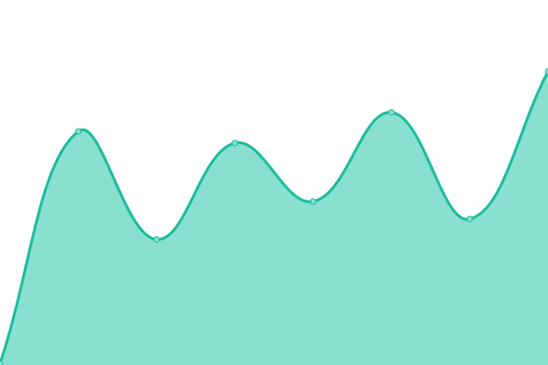

# [📈 Live Status](https://upptime.github.io/upptime): <!--live status--> **🟩 All systems operational**

This repository contains the open-source uptime monitor and status page for [Upptime](https://upptime.js.org), powered by [Upptime](https://github.com/upptime/upptime).

With [Upptime](https://upptime.js.org), you can get your own unlimited and free uptime monitor and status page, powered entirely by a GitHub repository. We use [Issues](https://github.com/upptime/upptime/issues) as incident reports, [Actions](https://github.com/erik1110/superhandy-monitor/actions) as uptime monitors, and [Pages](https://upptime.github.io/upptime) for the status page.

<!--start: status pages-->
<!-- This summary is generated by Upptime (https://github.com/upptime/upptime) -->
<!-- Do not edit this manually, your changes will be overwritten -->
<!-- prettier-ignore -->
| URL | Status | History | Response Time | Uptime |
| --- | ------ | ------- | ------------- | ------ |
|  [SuperHandy](https://superhandy-frontend.zeabur.app/) | 🟩 Up | [super-handy.yml](https://github.com/erik1110/web-monitor/commits/HEAD/history/super-handy.yml) | 

 1517ms
     
 | 

<a href="https://erik1110.github.io/web-monitor/history/super-handy">100.00%</a>
    

|  [Blog](https://erik1110.com) | 🟩 Up | [blog.yml](https://github.com/erik1110/web-monitor/commits/HEAD/history/blog.yml) | 

 120ms
     
 | 

<a href="https://erik1110.github.io/web-monitor/history/blog">100.00%</a>
    

|  [Hotel Reservation Service](https://rere2133.github.io/ts30_booking_web/) | 🟩 Up | [hotel-reservation-service.yml](https://github.com/erik1110/web-monitor/commits/HEAD/history/hotel-reservation-service.yml) | 

 103ms
     
 | 

<a href="https://erik1110.github.io/web-monitor/history/hotel-reservation-service">100.00%</a>
    

<!--end: status pages-->

[**Visit our status website →**](https://erik1110.github.io/web-monitor/)

## 📄 License

- Powered by: [Upptime](https://github.com/upptime/upptime)
- Code: [MIT](./LICENSE) © [Upptime](https://upptime.js.org)
- Data in the `./history` directory: [Open Database License](https://opendatacommons.org/licenses/odbl/1-0/)
